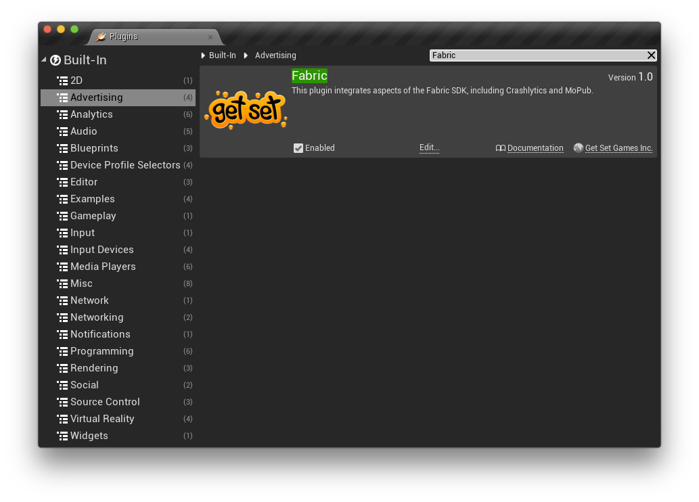
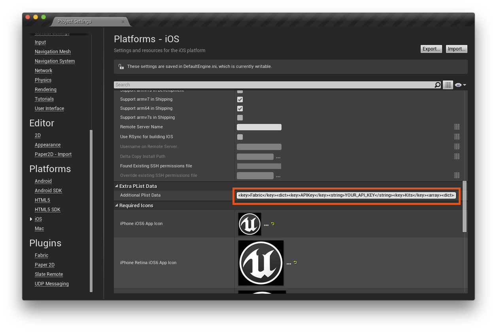

# Fabric
A plugin for Unreal Engine 4 that integrates Twitter's Fabric SDK, including Crashlytics and MoPub.

## Setup

### Integration

There are a couple of different ways to integrate this plugin into your project. You can include it in your fork of the UE4 engine or you can include it in a single UE4 code-based project if you like.

#### In your engine

This method includes the plugin in your fork of the UE4 engine. It allows you to use the plugin in either code or blueprint-based projects that are created with your fork of the engine. It assumes you have already cloned the UE4 engine to a directory on your machine.

1. Clone this repo to a subfolder of your engine called /Engine/Plugins/Fabric folder. Optionally, you can add it as a submodule.
2. Run the GenerateProjectFiles script in the Engine root.
3. Open your engine project file and build the editor.

#### In your code project

This method includes the plugin in a single code-based project. This can be done on any code-based project that is created using the Github source engine or the one provided by Epic via the launcher.

1. Clone this repo to a subfolder in your project called /Plugins/Fabric.
2. Open your project. You will be prompted to build missing modules.
3. Select Yes to rebuild now.

### Enable the Plugin

Ensure that the plugin is enabled:

1. In the editor, select Plugins from the Window menu.
2. Search for the plugin called Fabric. It's in the Advertising category.
3. Check the Enabled checkbox on the plugin. You may have to restart the editor after this step.



### Add Extra Plist Data

Open your Project Settings and navigate to the Platforms > iOS area. In the field called Additional Plist Data, add the following dictionary key, replacing the APIKey field value with your own Fabric API Key.

```plist
<key>Fabric</key>
<dict>
	<key>APIKey</key>
	<string>YOUR_API_KEY</string>
	<key>Kits</key>
	<array>
		<dict>
			<key>KitInfo</key>
			<dict/>
			<key>KitName</key>
			<string>Crashlytics</string>
		</dict>
		<dict>
			<key>KitInfo</key>
			<dict/>
			<key>KitName</key>
			<string>MoPub</string>
		</dict>
	</array>
</dict>
```


